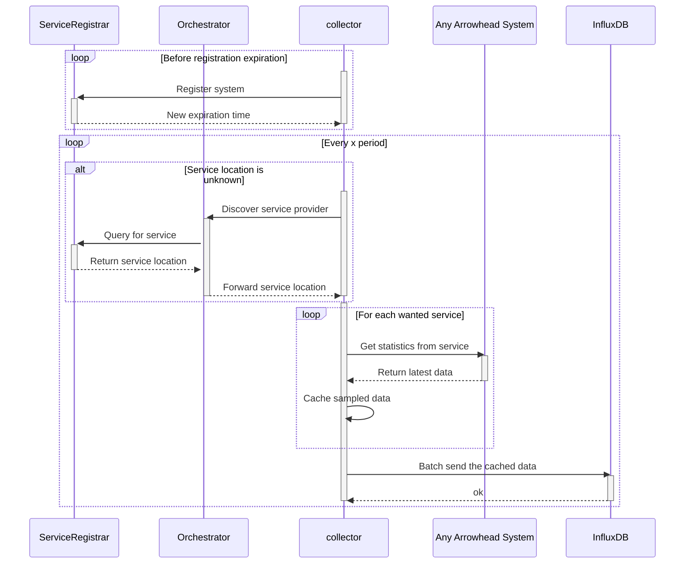

# collector

This is a data collector for gathering statistics from other Arrowwhead systems.
The collected samples will then be sent to an InfluxDB instance, which can present
the data as pretty graphs for example.

## Setup

This requires a locally running InfluxDB instance.

The easiest way to run everything is by using the provided `docker-compose.yml`
file in the root folder of this repository. Copy the file and update the settings
to your liking. For example, it would be a good idea to change the name and password
of the InfluxDB administrator.

Next, you have to run the collector system once to generate a new default config
file and letting InfluxDB run it's setup.
This can be done by running `docker-compose up`.

*Note that the collector will print an error and quit, which may look confusing but
it was simply generating a new config.*

Clean up the containers by running `docker-compose down`.

Edit the config file located at `./data/collector/systemconfig.json`.
The Influx settings should reflect the settings used in `docker-compose.yml`.
The authorisation token for Influx's API can be found in `./data/influxdb/config/influx-configs`.
A default set of sampled services has been provided by default, make any required
changes that reflects your own setup.

## Running

When the setup have been performed, you can run the docker containers again.
You can browse and login to InfluxDB by visiting `http://localhost:8086/`.

- Running systems in the background: `docker-compose up -d`
- Stopping all systems: `docker-compose down`
- Show the system logs: `docker-compose logs`
- Show live logs: `docker-compose --tail 100 -f`

## Design

The following sequence diagram documents the work flows this system performs
while running and how it interacts with the other Arrowhead systems and InfluxDB.

